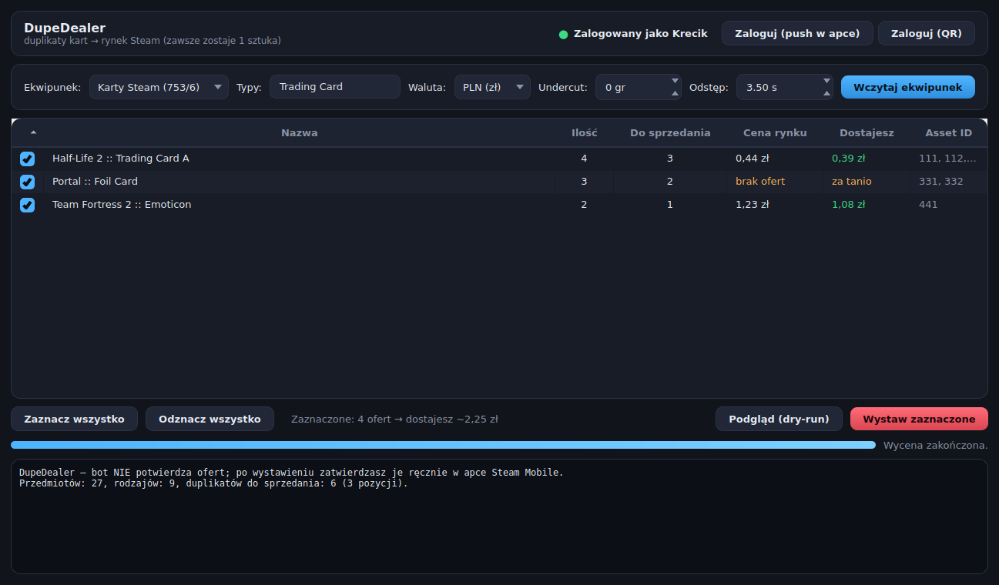

<div align="center">

# 🏷️ DupeDealer

**Wystawia duplikaty kart i przedmiotów Steam na rynku — zawsze zostawiając po jednej sztuce każdego rodzaju.**

Aplikacja okienkowa na Windows (ciemne GUI) i skrypt CLI. Bez przeglądarki, na czystym `requests`.

[](../../releases/latest)
&nbsp;

&nbsp;




</div>

> [!WARNING]
> **Korzystasz na własną odpowiedzialność.** Automatyzacja rynku Steam może naruszać
> [Steam Subscriber Agreement](https://store.steampowered.com/subscriber_agreement/) i grozić
> ograniczeniem konta lub rynku. Projekt edukacyjny, dostarczany „as is", bez gwarancji.
> Nie podawaj danych logowania na maszynach, którym nie ufasz.

---

## Co to robi

Masz w ekwipunku Steam dziesiątki powtórzonych kart? Ten program grupuje przedmioty po
`market_hash_name`, **zostawia po jednej sztuce każdego rodzaju**, a resztę wystawia na rynku
po cenie wyliczonej z aktualnych ofert. Oferty **potwierdzasz sam** w apce Steam Mobile —
bot nigdy nie robi tego za Ciebie.

**Przebieg:**

1. Logujesz się (push do apki Steam albo kod QR) — bez ręcznego wklejania ciasteczek.
2. Wczytujesz ekwipunek i widzisz tabelę duplikatów z ceną rynku i kwotą „dostajesz".
3. Zaznaczasz, co wystawić, robisz podgląd (dry-run) albo realnie wystawiasz.
4. Wchodzisz do apki Steam Mobile → **Potwierdzenia → Zatwierdź wszystko**.

## Funkcje

- ✅ **Bezpieczna logika** — zawsze zostawia 1 sztukę rodzaju, wystawia tylko nadmiar.
- 🖥️ **Nowoczesne GUI** (PySide6, ciemny motyw): sortowalna tabela z checkboxami, wycena
  w tle z paskiem postępu, podgląd i wystawianie z potwierdzeniem.
- 🔐 **Logowanie bez ciasteczek** — push do apki albo kod QR; sesja odtwarzana po cichu
  z refresh tokenu (ważny wiele miesięcy).
- 🎮 **Wiele ekwipunków** — karty (753/6), TF2 (440/2), CS2 (730/2), Dota 2 (570/2) + filtr typów.
- 💰 **Wycena z rynku** (`priceoverview`) z odjęciem prowizji Steam (~15%) i opcją *undercut*.
- 🧪 **Ten sam silnik w CLI** — dobry do crona; wbudowany `--selftest`.

---

## Szybki start (Windows)

1. Pobierz **`DupeDealer.exe`** z [zakładki Releases](../../releases/latest).
2. Uruchom. Plik nie jest podpisany, więc SmartScreen może ostrzec —
   „Więcej informacji" → „Uruchom mimo to".
3. **Zaloguj (push w apce)** lub **Zaloguj (QR)** i zatwierdź logowanie w telefonie.
4. Wybierz ekwipunek → **Wczytaj ekwipunek**, poczekaj na wycenę.
5. Zaznacz pozycje → **Podgląd** (nic nie robi) lub **Wystaw zaznaczone**.
6. Zatwierdź oferty w apce Steam Mobile (Potwierdzenia → Zatwierdź wszystko).

Token logowania zapisze się w `%APPDATA%\DupeDealer\refresh_token`.
Hasło nie jest zapisywane nigdzie na dysku.

## Uruchomienie ze źródeł

Działa tak samo na Windows i Linux:

```bash
python -m venv venv
venv/bin/pip install -r requirements.txt        # Windows: venv\Scripts\pip
venv/bin/python dupedealer_gui.py             # Windows: venv\Scripts\python
```

### Zbudowanie własnego `.exe`

Na Windowsie z Pythonem 3.10+ w PATH wystarczy:

```bat
build.bat
```

Wynik: `dist\DupeDealer.exe` (jeden plik, bez konsoli). Ręczny odpowiednik:

```bat
pyinstaller --onefile --windowed --icon app.ico --name DupeDealer ^
    --add-data "app.ico;." --collect-submodules steam.protobufs dupedealer_gui.py
```

Wersje release'owe buduje GitHub Actions (`.github/workflows/release.yml`) po pushu taga `v*`.

> **Dlaczego `--collect-submodules steam.protobufs`?** Pakiet `steam` ładuje protobufy
> dynamicznie — bez tego w gotowym `.exe` zabraknie `steammessages_auth_pb2` i logowanie
> się wysypie. Zostaw też pin **`protobuf==3.20.3`** (nowszy nie ma `google.protobuf.service`,
> którego wymagają wygenerowane `*_pb2`).

---

## Wariant CLI

**Domyślnie dry-run** — realnie wystawia dopiero z `--sell`.

```bash
python dupedealer.py            # podgląd: co i za ile by wystawił
python dupedealer.py --sell     # realne wystawienie duplikatów
```

| Flaga | Domyślnie | Opis |
|-------|-----------|------|
| `--sell` | off (dry-run) | realnie wystaw oferty |
| `--app` | `753/6` | `appid/contextid`: `753/6`=karty, `440/2`=TF2, `730/2`=CS2, `570/2`=Dota2 |
| `--types` | `Trading Card` | typy po przecinku; **puste `''` = wszystkie marketable duplikaty** |
| `--currency` | `6` | waluta wyceny: `6`=PLN, `3`=EUR, `1`=USD |
| `--undercut` | `0` | o ile groszy zejść poniżej ceny kupującego |
| `--delay` | `3.5` | przerwa między żądaniami (s) — Steam mocno rate-limituje |
| `--noninteractive` | off | tryb cron: gdy logowanie wygasło → wyjście (opcjonalny alert Telegram) |
| `--selftest` | — | testy jednostkowe wyceny/parsera i wyjście |

Logowanie z linii poleceń: `python steam_auth.py --login` (push) lub `--qr` (kod do zeskanowania).

Przykład crona (tygodniowo, bez blokowania na logowanie):

```cron
0 12 * * 0 cd ~/DupeDealer && venv/bin/python dupedealer.py --sell --noninteractive
```

## Konfiguracja (zmienne środowiskowe)

Wszystko jest opcjonalne — w GUI dane logowania wpisujesz w okienku.

| Zmienna | Rola |
|---------|------|
| `STEAM_LOGIN`, `STEAM_PASSWORD` | dane do logowania `--login` (dla CLI/crona) |
| `STEAM_TOKEN_FILE` | ścieżka pliku refresh tokenu (dom. `~/.steam_refresh_token`; Windows GUI: `%APPDATA%\DupeDealer\`) |
| `STEAM_SECRETS_FILE` | opcjonalny plik `KEY=VALUE` z powyższymi sekretami |
| `TG_TOKEN`, `TG_CHAT_ID` | opcjonalne powiadomienia Telegram (bez nich po prostu pomijane) |

## Jak liczona jest cena

`priceoverview` zwraca najniższą aktualną ofertę. Funkcja `buyer_price_to_receive()` odejmuje
**prowizję Steam (~15%**, min. 1 gr dla Steam + 1 gr dla twórcy gry), by wyliczyć kwotę, jaką
masz *dostać*, żeby kupujący zapłacił nie więcej niż obecny lowest price. Z opcją *undercut*
schodzisz jeszcze o kilka groszy poniżej. Ceny są cache'owane po nazwie przedmiotu.

## Bezpieczeństwo

- Refresh token i wszelkie sekrety **nie trafiają do repozytorium** (`.gitignore`) ani do
  interfejsu czy logów.
- Hasło w GUI żyje tylko w pamięci na czas logowania — nie jest zapisywane na dysk;
  trwale trzymany jest wyłącznie refresh token (na Windowsie w `%APPDATA%`).
- Bot **nie ma** `identity_secret` / sekretów 2FA, więc nie potwierdza ofert automatycznie —
  każdą zatwierdzasz ręcznie w apce Steam Mobile.

## Uwagi techniczne

Dla osób zaglądających w kod / rozwijających projekt:

- Endpoint ekwipunku wymaga nagłówka **`Referer`** i `count` **≤ 2000** (5000 → HTTP 400).
- `priceoverview` jest ostro rate-limitowane (~20 żądań/min) — dlatego stały odstęp między
  żądaniami (`--delay` / suwak *Odstęp*) i cache po nazwie.
- Logowanie: `GetPasswordRSAPublicKey` to **GET**, reszta `Begin*/Poll*` to POST;
  `platform_type = WebBrowser (2)`, `os_type = -500`; sesja web idzie przez `finalizelogin`.
- Kod QR rysuje własny `tiny_qr.py` (zero zależności), zweryfikowany bit-w-bit z referencyjnym
  enkoderem.

## Licencja

[MIT](LICENSE).
